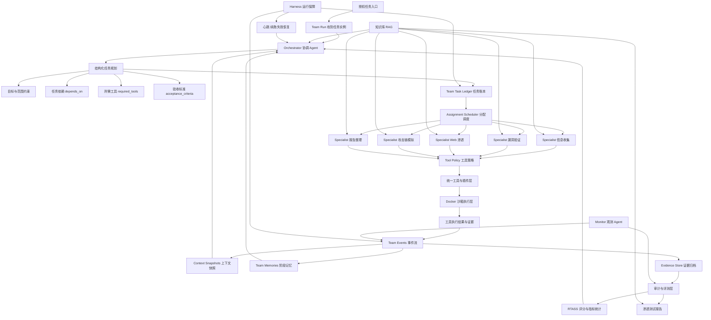

# AI 自动化攻防平台建设方案

## 1. 背景与建设目标

为支撑公司全年内部攻防行动、红队演练、安全验证与风险闭环，拟基于现有 Sentinel AI 项目能力，建设一套面向企业内部授权场景的 AI 自动化攻防平台。

平台目标不是简单集成单点扫描工具，而是形成“AI 自主决策、自动化执行、过程可审计、结果可度量、风险可闭环”的攻防验证体系。通过协调 Agent 与专业 Agent 的多层架构，将资产识别、攻击面分析、漏洞验证、Web 渗透、后渗透模拟、报告生成和实战评测串联为可持续运行的自动化流程。

建设完成后，平台应具备以下能力目标：

- 支撑全年内部攻防行动与常态化安全验证。
- 具备完整红队攻击链模拟能力，覆盖从信息收集到攻击路径复盘的闭环。
- 在授权靶场、隔离测试环境和内部演练环境中实现高比例自动化决策与执行。
- 所有执行行为均在受控沙箱内完成，并形成完整审计记录。
- 输出面向管理层、安全团队和业务团队的标准化渗透测试报告与风险整改建议。

## 2. 建设原则

### 2.1 授权边界优先

平台仅用于公司授权范围内的内部靶场、测试环境、攻防演练环境和安全验证任务。所有任务必须绑定目标范围、授权依据、执行窗口和责任人，避免自动化能力脱离治理边界。

### 2.2 自动化与可控性并重

平台追求 AI 自动决策和自动执行，但关键高风险动作必须具备策略控制、审批机制、执行熔断、回滚预案和审计追踪。自动化能力不能以牺牲安全边界和可解释性为代价。

### 2.3 工具能力平台化

Nuclei、XRAY、端口扫描、指纹识别、流量分析、PoC 验证、报告生成等能力应通过统一工具层和插件体系接入，由调度引擎统一管理、调用、记录和评估，避免形成不可治理的脚本堆叠。

### 2.4 结果可度量

平台建设必须围绕明确指标验收，包括信息收集耗时、模板规模、策略选择准确率、漏洞验证准确率、靶场攻破率、自主决策率、审计完整性、报告完整度和 RTASS 评分结果。

### 2.5 审计可追溯

每一次 AI 决策、工具调用、命令执行、网络请求、漏洞验证、证据采集和报告生成都必须保留结构化审计记录，支持事后复盘、责任追踪和合规检查。

## 3. 总体架构

平台 Agent 架构建议以本项目现有 Team V4 架构为基础，采用“Orchestrator 协调 + Specialist 专业执行 + Monitor 观测 + Harness 运行保障”的多 Agent 协作模式。

核心技术说明：

- **Team Run**：每次攻防任务生成独立运行实例，绑定授权范围、目标、策略和审计上下文。
- **Orchestrator**：负责任务拆解、依赖编排、专业 Agent 分配、失败恢复和阶段验收。
- **Specialist**：按任务类型执行专项动作，通过统一工具层调用扫描、验证、流量分析和报告能力。
- **Task Ledger**：记录任务状态、依赖关系、验收标准和执行结果，是调度与续跑的事实源。
- **RAG 知识库**：提供 SOP、历史案例、漏洞知识、工具规范、报告模板和 RTASS 评分口径。
- **Tool Policy**：控制 Agent 可用工具、参数边界、审批条件和高风险动作限制。
- **Docker 沙箱**：承载所有工具和命令执行，隔离网络、文件系统和运行权限。
- **Events / Snapshots / Memories**：沉淀过程事件、上下文快照和阶段结论，支撑复盘与连续决策。
- **审计与评测层**：汇总证据、日志、指标和评分，输出可追溯报告。

### 3.1 协调 Agent 层

协调 Agent 负责理解任务目标、拆解攻击阶段、选择专业 Agent、控制任务依赖、评估阶段结果，并根据反馈动态调整策略。其定位是整个攻防任务的决策中枢。

协调 Agent 需要具备：

- 任务理解与范围约束能力。
- 攻击链规划与阶段编排能力。
- 专业 Agent 调度能力。
- 失败恢复与策略调整能力。
- 风险判断与审批触发能力。
- 结果汇总与报告组织能力。

### 3.2 专业 Agent 层

专业 Agent 面向不同攻防阶段提供专项能力，包括侦察、漏洞扫描、Web 渗透、漏洞验证、后渗透模拟、风险评估、报告生成等方向。专业 Agent 不直接决定全局攻击路径，而是在协调 Agent 的约束下完成明确任务。

该分层有助于降低单一 Agent 上下文过载、提升任务可解释性，并便于后续扩展新的专项能力。

### 3.3 工具执行层

工具执行层承载实际安全工具、插件、脚本和沙箱命令。所有工具均通过统一接口暴露给 Agent，执行过程由平台负责权限控制、参数校验、超时控制、输出归档和异常处理。

工具执行层应支持：

- 标准化工具注册与调用。
- 插件化能力扩展。
- 执行沙箱隔离。
- 输出结构化解析。
- 工具执行审计。
- 失败重试与超时控制。

### 3.4 沙箱与隔离层

所有攻击性、验证性和命令执行类操作均在 Docker 沙箱中运行。平台应根据任务类型提供不同隔离策略，并通过网络边界、资源限制、文件系统限制和执行策略降低风险。

平台建设中应将“Docker 沙箱执行”作为强约束，而非可选能力。生产评审版本中不应允许自动回落到宿主机执行。

### 3.5 审计与评测层

审计与评测层负责采集平台运行全过程数据，包括任务输入、AI 决策、工具调用、命令输出、证据文件、风险结论、人工介入、审批记录和最终报告。

同时，该层负责输出 RTASS 实战验证结果，并计算自主决策率、攻击有效性、业务风险影响和报告完整度等指标。

## 4. 建设范围

本项目建议从现有 Sentinel AI 中抽取和强化以下平台级能力：

- AI 多 Agent 调度与任务执行框架。
- 工具与插件统一接入体系。
- Docker 沙箱执行基础。
- 流量分析与 Web 安全验证工作台。
- 资产、漏洞、证据和报告数据模型。
- 工作流编排与定时调度能力。
- 审计日志与执行追踪能力。
- 知识库与历史经验复用能力。

不建议在一期中追求所有高级攻击能力一次性完整落地。更合理的方式是先形成可运行、可审计、可评测的攻防自动化底座，再逐步提升专业攻击能力和实战评分。

## 5. 关键建设指标

### 5.1 信息收集指标

- 覆盖子域名、端口、指纹、目录、JS 敏感信息等攻击面信息。
- 单目标自动化信息收集耗时小于 30 分钟。
- 结果应支持资产归并、去重、证据留存和变化追踪。

### 5.2 漏洞扫描与验证指标

- 集成 Nuclei、XRAY 等主流扫描与验证能力。
- 模板数量不少于 500 个。
- 策略选择准确率不低于 70%。
- 漏洞验证准确率不低于 85%。
- 支持误报标记、验证回放和结果复核。

### 5.3 Web 渗透指标

- 覆盖 OWASP Top 10 主要攻击类型。
- 在授权靶场中，高难度场景攻破率不低于 60%。
- 支持攻击路径、关键请求、响应证据和利用结果留存。

### 5.4 后渗透与横向移动指标

- 在隔离靶场中支持完整攻击链闭环验证。
- 支持提权、凭证获取、横向移动、持久化等阶段的安全模拟与审计。
- 高风险能力必须绑定靶场环境、授权策略和操作留痕。

### 5.5 沙箱与审计指标

- 所有自动化操作均在 Docker 沙箱中执行。
- 沙箱逃逸测试通过。
- 操作日志审计覆盖率达到 100%。
- 支持按任务、Agent、工具、目标、时间线进行追溯。

### 5.6 报告指标

- 自动生成渗透测试报告。
- 报告覆盖攻击路径、漏洞详情、证据材料、影响分析和修复建议。
- 报告完整度不低于 90%。

### 5.7 RTASS 实战验证指标

- 支持在具备 WAF、HIDS、网络隔离的内部靶场中全自动攻击验证。
- AI 自主决策率不低于 80%。
- RTASS 进攻能量 OE 不低于 7.00。
- RTASS 业务风险 BR 不低于 6.00。

## 6. 实施路径

### 第一阶段：平台底座建设

目标是将现有项目能力整理为可评审、可部署、可运行的攻防平台基础版本。

重点工作：

- 梳理现有 Sentinel AI 能力边界。
- 固化多 Agent 调度架构。
- 统一工具与插件接入规范。
- 强化 Docker 沙箱执行策略。
- 建立审计日志和证据留存规范。
- 形成基础任务编排与报告输出能力。

阶段成果：

- 平台总体架构可运行。
- 基础自动化信息收集链路可用。
- 工具调用可审计。
- 初版报告可自动生成。

### 第二阶段：自动化攻防能力增强

目标是围绕公司指标补齐核心攻防能力，使平台具备稳定的漏洞扫描、漏洞验证和 Web 渗透能力。

重点工作：

- 接入主流漏洞扫描与验证工具。
- 建设模板管理与策略选择机制。
- 建设 OWASP Top 10 靶场验证体系。
- 将流量分析、漏洞发现、证据采集和报告生成串联。
- 建立误报复核与准确率统计机制。

阶段成果：

- 信息收集耗时达到指标要求。
- 模板数量和验证准确率达到阶段要求。
- Web 渗透靶场攻破率具备可量化结果。

### 第三阶段：完整攻击链与实战评测

目标是形成面向内部攻防行动的完整攻击链闭环，并通过 RTASS 实战验证。

重点工作：

- 建设隔离靶场中的后渗透与横向移动模拟能力。
- 建设攻击链阶段评估与任务恢复机制。
- 建设 RTASS 自动评测与评分归档机制。
- 完善审批、熔断、回滚和安全治理能力。
- 输出年度攻防行动运营方案。

阶段成果：

- 内部靶场可完成自动化攻击链闭环。
- 自主决策率、OE、BR 达到验收指标。
- 平台具备支撑全年攻防行动的运营能力。

## 7. 组织分工建议

建议按以下角色组织建设与评审：

- 平台负责人：负责总体架构、建设节奏、跨团队协调和验收推进。
- AI Agent 负责人：负责多 Agent 调度、提示词策略、任务规划和自主决策评估。
- 安全能力负责人：负责扫描、验证、Web 渗透、后渗透靶场能力建设。
- 平台工程负责人：负责工具接入、沙箱、审计、数据模型和稳定性。
- 安全治理负责人：负责授权边界、审批策略、日志合规、风险控制和演练规则。
- 评测负责人：负责靶场设计、RTASS 评分、指标统计和验收报告。

## 8. 风险与治理措施

### 8.1 自动化攻击风险

风险：AI 自动化攻击能力如果缺少边界控制，可能对非授权资产造成影响。

治理措施：

- 所有任务必须绑定授权范围。
- 高风险动作必须配置审批或白名单策略。
- 默认仅允许在内部靶场和授权环境执行。
- 任务执行具备熔断和终止能力。

### 8.2 沙箱逃逸与宿主机风险

风险：攻击工具运行在宿主机或沙箱权限过高，可能影响平台自身安全。

治理措施：

- 强制 Docker 沙箱执行。
- 禁止自动回落宿主机。
- 按任务类型最小化容器权限。
- 定期执行沙箱逃逸测试。

### 8.3 误报与误判风险

风险：AI 策略选择或漏洞验证误判会影响报告可信度。

治理措施：

- 建立验证准确率指标。
- 保留请求、响应、截图、命令输出等证据。
- 引入复核机制和误报反馈。
- 以历史验证结果优化策略选择。

### 8.4 审计不完整风险

风险：如果审计链路缺失，平台无法满足复盘、合规和责任追踪要求。

治理措施：

- 工具调用、命令执行、AI 决策和报告生成全链路记录。
- 所有证据文件生成哈希和引用 ID。
- 报告中的每个关键结论必须能追溯到证据。

### 8.5 指标不可验收风险

风险：如果指标定义不清，后续验收容易变成主观判断。

治理措施：

- 在建设初期固化指标口径。
- 建设自动化评测任务。
- 每次演练生成结构化评分结果。
- 将 RTASS 评分纳入正式验收材料。

## 9. 评审关注点

本方案评审建议重点关注以下问题：

- 平台是否满足公司对全年内部攻防行动的支撑目标。
- 多 Agent 架构是否能支撑复杂任务拆解和专业能力扩展。
- Docker 沙箱、授权范围和审计机制是否满足治理要求。
- 关键指标是否可量化、可复现、可验收。
- 分阶段建设路径是否符合当前团队资源和交付周期。
- 后渗透与横向移动能力是否限定在隔离靶场和授权演练范围内。
- RTASS 验证环境和评分口径是否需要提前与相关团队对齐。

## 10. 结论

基于现有 Sentinel AI 项目，建设 AI 自动化攻防平台具备较好的工程基础。现有项目已经覆盖 AI 助手、多 Agent 调度、工具接入、插件体系、流量分析、工作流编排、沙箱执行、漏洞与报告数据基础等关键底座能力。

后续建设重点不应放在重新开发平台框架，而应放在三件事上：

- 将现有能力产品化、平台化、审计化。
- 补齐红队攻击链中扫描验证、Web 渗透、后渗透和 RTASS 评测能力。
- 建立授权、沙箱、审批、熔断、审计和指标验收机制。

建议按“三阶段”推进：先完成平台底座和审计闭环，再补齐自动化攻防能力，最后建设完整攻击链和 RTASS 实战验证体系。该路径风险相对可控，能够较快形成可评审、可演示、可验收的阶段成果，并逐步支撑公司全年内部攻防行动。
