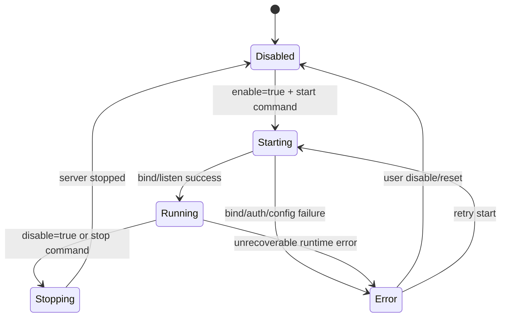

# HTTP Gateway 功能技术设计（LAN + Remote）

## 1. 背景与目标

### 1.1 背景
- 当前 Sentinel AI 已具备可启动/停止的服务型能力（例如 `start_terminal_server` / `stop_terminal_server`）。
- 现有能力主要通过 Tauri 命令在桌面内调用，缺少标准 HTTP 对外入口。
- 需要新增“可选启用”的 HTTP Gateway，让 AI 助手可被局域网和远程调用。

### 1.2 目标
- 新增 HTTP Gateway，将 AI 助手能力以 HTTP 方式暴露。
- 支持局域网访问（LAN）和远程访问（Remote）。
- 服务默认关闭（secure-by-default）。
- 用户可以在设置页一键启停，并可查看运行状态。
- 远程访问必须启用认证；无认证时禁止远程暴露。

### 1.3 非目标
- 本期不实现完整多租户体系。
- 本期不引入复杂 IAM（OAuth2/OIDC）作为必选，仅保留 API Key。
- 本期不改造 AI 推理核心逻辑，仅增加 HTTP 访问层。

## 2. 需求与约束

### 2.1 功能需求
- `R1`：支持 HTTP 启停与状态查询。
- `R2`：支持一次性对话请求（非流式）与流式回复（SSE）。
- `R3`：支持会话化接口（创建/续写/结束会话）。
- `R4`：支持局域网访问开关。
- `R5`：支持远程访问模式（通过反向代理/隧道接入）。

### 2.2 安全需求
- `S1`：默认 `enabled=false`。
- `S2`：默认只监听 `127.0.0.1`。
- `S3`：`allow_lan=true` 或 `remote.enabled=true` 时，强制 `auth.required=true`。
- `S4`：包含基础限流与请求大小限制。
- `S5`：输出访问审计日志（成功、失败、拒绝原因）。

### 2.3 兼容性需求
- 与现有配置持久化方式一致（复用 `config` category + key）。
- 与现有服务管理模式一致（复用全局单例 + start/stop/status 命令模式）。
- 前端设置入口放在 `Settings -> Network`（或新增 `AI Gateway` 分组）。

## 3. 方案总览

### 3.1 组件结构
- `gateway_http`（Rust）：HTTP Server 与路由层（建议 `axum`）。
- `gateway_auth`：API Key 校验与权限判定。
- `gateway_runtime`：服务生命周期与状态机。
- `gateway_config`：配置读写、运行时热更新（受控范围）。
- `gateway_observability`：日志、指标、审计事件。

### 3.2 复用点（当前代码）
- 复用现有命令风格：`src-tauri/src/commands/terminal_commands.rs`。
- 复用现有配置存储：`src-tauri/src/commands/config.rs`（`set_config/get_config`）。
- 复用现有设置页入口：`src/components/Settings/NetworkSettings.vue`。

## 4. API 草案（v1）

### 4.1 管理接口（仅本机 Tauri 命令触发，不直接开放公网）
- `POST /internal/gateway/start`
- `POST /internal/gateway/stop`
- `GET /internal/gateway/status`

说明：这些接口不建议直接作为外部 HTTP 暴露；实际由 Tauri 命令封装。

### 4.2 对外业务接口
- `GET /health`
  - 返回网关健康状态。
- `POST /api/chat`
  - 非流式问答，返回一次性结果。
- `POST /api/chat/stream`
  - SSE 流式输出增量 token 与最终完成事件。
- `POST /api/session`
  - 创建会话，返回 `session_id`。
- `POST /api/session/{session_id}/chat`
  - 在指定会话中继续对话。
- `DELETE /api/session/{session_id}`
  - 主动结束会话。

### 4.3 请求示例
```json
POST /api/chat
{
  "message": "总结最近一次扫描结果",
  "model": "default",
  "metadata": {
    "client_id": "team-a-dashboard"
  }
}
```

### 4.4 响应示例
```json
{
  "id": "resp_01",
  "message": "已完成总结……",
  "usage": {
    "prompt_tokens": 120,
    "completion_tokens": 340
  },
  "request_id": "req_9f1a"
}
```

### 4.5 错误模型
```json
{
  "error": {
    "code": "UNAUTHORIZED",
    "message": "Missing or invalid API key"
  },
  "request_id": "req_9f1a"
}
```

建议错误码：
- `BAD_REQUEST`
- `UNAUTHORIZED`
- `FORBIDDEN`
- `RATE_LIMITED`
- `SERVICE_UNAVAILABLE`
- `INTERNAL_ERROR`

## 5. 配置模型（默认安全）

### 5.1 配置字段
```json
{
  "http_gateway": {
    "enabled": false,
    "host": "127.0.0.1",
    "port": 18765,
    "allow_lan": false,
    "cors": {
      "enabled": false,
      "origins": []
    },
    "auth": {
      "required": false,
      "api_keys": [],
      "header_name": "X-API-Key"
    },
    "remote": {
      "enabled": false,
      "mode": "reverse_proxy",
      "public_base_url": ""
    },
    "limits": {
      "max_body_bytes": 1048576,
      "requests_per_minute": 60,
      "max_concurrent_requests": 8
    },
    "audit": {
      "enabled": true,
      "log_auth_failures": true
    }
  }
}
```

### 5.2 强制校验规则
- `V1`：`enabled=true` 且 `allow_lan=false` 时，`host` 只能为 loopback（`127.0.0.1` / `::1`）。
- `V2`：`allow_lan=true` 时，必须 `auth.required=true` 且 `api_keys` 非空。
- `V3`：`remote.enabled=true` 时，必须 `auth.required=true` 且 `public_base_url` 非空。
- `V4`：`port` 必须在 `1024..65535`。

### 5.3 持久化键建议
- category: `network`
- key: `http_gateway_config`

## 6. 状态机设计



状态定义：
- `Disabled`：未监听端口。
- `Starting`：校验配置并绑定端口中。
- `Running`：对外服务中。
- `Stopping`：优雅关闭中。
- `Error`：启动或运行失败，保留错误信息供 UI 展示。

## 7. 安全设计

### 7.1 认证
- Header: `X-API-Key`（可配置）。
- 比对方式：存储 hash（建议 `argon2`），不落明文。
- 密钥轮换：支持多 key 并行（`active + grace`）。

### 7.2 网络暴露策略
- 默认仅本机可访问。
- 开启 LAN 时，UI 弹出风险确认（明确提示同网段可访问）。
- 开启 Remote 时，UI 二次确认并展示“公网暴露风险”。

### 7.3 限流与防滥用
- 基于 IP + API key 双维度限流。
- 超限返回 `429`，并记录审计事件。
- 限制请求体大小与超时时间，避免资源耗尽。

### 7.4 CORS
- 默认禁用 CORS。
- 启用后必须设置白名单 origins，禁止 `*` 与凭证模式混用。

## 8. 前后端改造点

### 8.1 Rust（Tauri 命令层）
- 新增文件建议：`src-tauri/src/commands/http_gateway_commands.rs`
- 新增命令：
  - `start_http_gateway(config?: HttpGatewayConfig)`
  - `stop_http_gateway()`
  - `get_http_gateway_status()`
  - `get_http_gateway_config()`
  - `save_http_gateway_config(config)`
  - `rotate_http_gateway_api_key()`
- 在 `src-tauri/src/lib.rs` 注册上述 commands。

### 8.2 Rust（服务层）
- 新增文件建议：`src-tauri/src/services/http_gateway.rs`
- 结构参考 `terminal_commands.rs` 的全局单例模式。
- 使用异步任务托管服务生命周期与优雅关闭。

### 8.3 Frontend
- 新增 API 封装：`src/api/httpGateway.ts`
- 设置页扩展：
  - 文件：`src/components/Settings/NetworkSettings.vue`
  - 增加 Gateway 分区：开关、host/port、LAN、Remote、API key、限流、状态展示。
- i18n 增加中英文文案（`settings/network` 模块）。

## 9. 可观测性与运维

### 9.1 日志
- 启停事件：`gateway.start`, `gateway.stop`
- 安全事件：`gateway.auth.fail`, `gateway.rate_limited`
- 请求日志：method/path/status/latency/request_id

### 9.2 指标（可选）
- `gateway_requests_total`
- `gateway_requests_inflight`
- `gateway_request_latency_ms`
- `gateway_auth_failures_total`

## 10. 测试计划

### 10.1 单元测试
- 配置校验规则（V1~V4）。
- API key 校验与 hash 比对。
- 限流策略。

### 10.2 集成测试
- 启停流程与状态切换。
- `127.0.0.1` 与 `0.0.0.0` 绑定行为。
- 未授权、错误 key、超限请求返回码。
- 流式接口中断恢复与资源回收。

### 10.3 E2E（前端）
- 默认状态关闭。
- 用户开启后状态变为运行。
- 风险开关（LAN/Remote）触发确认弹窗与必填校验。
- 关闭后端口不可达。

## 11. 里程碑与 Issue 拆分

### Milestone A：基础可用（MVP，2~3 天）
1. `A1` 网关服务骨架与 `/health`。
2. `A2` 启停/status 命令与配置存取。
3. `A3` 设置页开关 + 状态显示。
4. `A4` 默认关闭 + 本机绑定回归测试。

### Milestone B：安全可用（2 天）
1. `B1` API key 认证与密钥管理（hash 存储）。
2. `B2` LAN/Remote 强制校验规则。
3. `B3` 限流、请求体限制、超时控制。
4. `B4` 审计日志。

### Milestone C：对外能力完整（2~3 天）
1. `C1` `POST /api/chat` 非流式接口。
2. `C2` `POST /api/chat/stream` SSE。
3. `C3` 会话接口（create/continue/delete）。
4. `C4` 文档与示例（curl + JS SDK 示例）。

## 12. 风险清单与缓解

- 风险：用户误开公网暴露。
  - 缓解：默认关闭 + 二次确认 + 强制认证 + 明显告警文案。
- 风险：端口冲突导致启动失败。
  - 缓解：启动前探测端口并返回可读错误。
- 风险：滥用导致性能下降。
  - 缓解：限流、并发上限、超时与请求体限制。
- 风险：流式连接泄漏。
  - 缓解：连接心跳与超时回收。

## 13. 发布准入（DoD）

- 默认安装后，网关未运行且不可被 LAN/公网访问。
- 开启 LAN 或 Remote 时，未配置认证无法保存配置。
- 所有对外接口具备 request_id 与错误模型。
- 关键路径测试通过（单元、集成、E2E）。
- README 与 Settings 文案完成更新。

