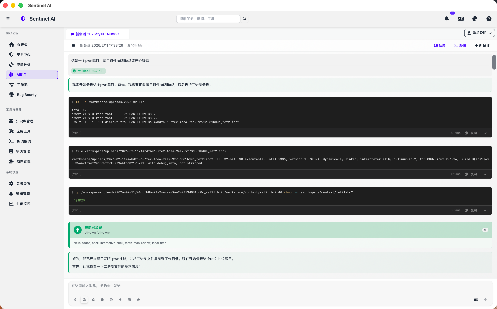

# Sentinel AI Community Edition

**中文** | [English](./README.en.md)

> AI 驱动的桌面安全分析平台 — 开源 Community 版

**Community Edition** 包含流量分析、AI 助手、工作流、RAG 知识库、插件系统与工具生态。**漏洞赏金（Bug Bounty）模块不包含在本版本**，该功能仅在 [Sentinel AI Pro](https://github.com/o0x1024/sentinel-ai-pro) 商业版中提供。

Sentinel AI 面向安全研究与攻防工程团队，目标不是单点工具，而是把 **流量分析**、**AI 助手**、**工作流自动化**、**知识库（RAG）**、**插件系统** 和 **工具生态（MCP/内置工具）** 连接成一个可持续迭代的分析闭环。

## 为什么是 Sentinel AI

传统安全工具链常见问题：

- 数据分散：流量、漏洞、资产、笔记、脚本分散在多个系统
- 自动化断层：发现问题后，验证、复测、通知、归档仍靠人工串联
- AI 落地弱：AI 只能回答问题，无法稳定调用企业内部能力

Sentinel AI 的设计目标：

- 让流量与扫描结果成为 AI 可直接消费的上下文
- 让插件能力成为 AI 可调用的工具，而不是孤立脚本
- 让高频分析流程可沉淀为工作流并持续调度执行

## 核心能力矩阵

| 模块 | 核心能力 | 对应入口 |
| --- | --- | --- |
| 流量分析 Traffic Analysis | 代理监听、HTTPS 解密、请求/响应/WS 历史、拦截、重放、findings | 流量分析 |
| AI 助手 AI Assistant | 多轮对话、工具调用、子代理追踪、角色策略、会话管理 | AI 助手 |
| 工作流 Workflow Studio | 可视化编排、节点执行、调度运行、运行记录 | 工作流 |
| 知识库 RAG Management | 文档入库、向量检索、集合管理、检索增强问答 | RAG 管理 |
| 应用工具 Tools / MCP | 内置工具、MCP Server、插件工具、交互终端 | 应用工具 |
| 插件系统 Plugin Management | 插件开发、测试、审核、启停、商店安装与迭代 | 插件管理 |
| 系统设置 Settings | AI/数据库/网络/代理/RAG/授权等全局管理 | 系统设置 |

## 重点能力：插件系统 × AI 助手

这部分是 Sentinel AI 的核心差异化能力。

### 1. 插件不是“外挂”，而是“可治理的能力单元”

平台内插件主要分两类：

- **Traffic 插件**：挂在流量检测链路中，对 HTTP/WS 数据做规则化分析并产出 findings
- **Agent 工具插件**：注册到统一工具层，供 AI 助手与工作流直接调用

这意味着插件从一开始就具备：

- 生命周期管理（开发、测试、审核、发布、禁用）
- 可观测性（执行记录、结果回流、错误定位）
- 可编排性（可被 AI 和 Workflow 复用）

### 2. AI 助手直接调用插件能力

AI 助手不止用于问答，而是通过工具调用执行真实动作：

- 读取/分析流量与 findings
- 调用插件执行专项检测或数据处理
- 联动 MCP 与内置工具完成上下游动作
- 结合 RAG 知识库生成可复用的分析结论

### 3. 闭环流程（建议作为团队标准流程）

1. **流量侧发现问题**：Traffic 插件输出结构化 findings
2. **AI 侧补全分析**：AI 调用插件工具进行验证、归因、关联查询
3. **流程侧自动执行**：将成熟处置逻辑沉淀为工作流并调度运行
4. **知识侧持续沉淀**：结论写入知识库，供后续相似问题快速复用

这个组合把「发现 → 研判 → 执行 → 复盘」从人工链路升级为可持续自动化链路。

## 主要模块说明

### 流量分析（Traffic Analysis）

- 支持代理监听、拦截与重放，覆盖 HTTP/HTTPS/WS 关键分析场景
- 可结合流量插件实时产出检测结果并进入后续处置链路
- 可与 Proxifier、抓包能力组合使用，适配不同网络场景

### AI 助手（AI Assistant）

- 提供多轮上下文会话，支持角色策略和工具调用轨迹
- 支持子代理执行与结果回传，便于复杂任务拆解
- 可直接消费流量、资产、知识库、工具执行结果

### 工作流（Workflow Studio）

- 将高频分析流程抽象为节点化流程
- 支持保存、运行、停止、调度和运行记录查询
- 可复用插件工具与 MCP 工具，实现跨系统联动

### 知识库管理（RAG Management）

- 管理文档导入、分块、向量化和检索
- 为 AI 助手提供可追溯的知识增强上下文
- 支持规则、案例、手册等资产沉淀

### 应用工具（Tools / MCP）

- 统一管理内置工具、插件工具、工作流工具、MCP 工具
- 支持 MCP Server 接入、工具枚举和调用
- 内置终端能力，支持在同一工作台完成执行与验证

#### 内置工具一览

- **端口扫描**：对目标主机进行基础端口探测，适合快速确认服务暴露面，可被 AI 助手或工作流节点直接调用
- **HTTP 请求**：从 Agent 侧发起 HTTP(S) 请求，支持自定义方法、头和 Body，常用于复现/验证流量侧问题或对外部 API 做补充查询
- **本地时间**：获取当前本地时间信息，便于 Agent 在对话中给出带时间上下文的决策或做调度相关推理
- **内存与上下文管理**：为会话提供显式的长期记忆读写能力，用于在多轮任务中缓存中间结论和关键参数
- **OCR 识别**：对截图、图片等进行文字识别，结果可直接进入对话或后续工具链
- **子代理与并行执行**：支持在一个任务内派生子任务、并行执行并聚合结果，是复杂场景下的多代理编排基础设施
- **子代理状态与事件**：支持子代理之间的状态共享与事件总线，用于构建更复杂的协作关系和自愈逻辑
- **第十人审查**：通用反向论证/对抗审查能力，用于挑战既有假设、识别盲区与失败模式
- **待办与任务拆解**：允许 Agent 在对话中显式维护 TODO 列表，前端右侧面板会实时呈现
- **Web 搜索**：在受控环境下访问互联网搜索引擎，将外部信息作为上下文引入对话或分析流程
- **技能管理**：用于动态加载/列出现有技能，使 Agent 能够按需扩展能力集

### Shell / 交互式终端 / Docker 沙箱

- **一次性 Shell 工具**：通过 AI 助手工具层暴露，适合执行一次性命令并获取即时输出；默认优先在 Docker 沙箱容器中运行，Docker 不可用时才落到宿主机，并内置高危命令拦截策略
- **交互式终端**：适合运行需要持续交互的工具（如 SSH、数据库客户端、REPL 等），支持 PTY 会话、窗口大小调整、历史回放，以及 UI 与 LLM 共享同一会话
- **Docker 沙箱镜像**：Shell 与交互式终端在 Docker 模式下基于统一沙箱镜像运行，提供 minimal / kali / kali-full 等构建变体，可按需选择体积与工具集

### 插件系统（Plugin Management）

- 支持从开发到审核再到启停的完整流程
- 面向两类执行面：流量检测面与 Agent 工具面
- 插件能力可被 AI 与工作流重复利用，避免能力孤岛

### 系统设置（Settings）

- 统一管理 AI、数据库、代理、RAG、安全、授权等配置
- 便于团队部署、环境迁移和策略治理

## 快速开始

### 环境要求

- Node.js 18+
- Rust stable toolchain
- Tauri v2 构建依赖（按你的操作系统安装）

### 本地开发

1. 安装依赖：npm install
2. 前端开发：npm run dev
3. 桌面应用开发：npm run tauri dev
4. 构建：npm run build 或 npm run build:release

### 开发与测试

- 类型检查：npm run type-check
- 单元/集成测试：npm run test、npm run test:unit、npm run test:integration
- E2E：npm run test:e2e
- Rust 检查：在 src-tauri 目录执行 cargo check

## 项目结构

- **src/**：Vue 前端（views、components、services）
- **src-tauri/**：Tauri 与 Rust workspace（commands、sentinel-* 各能力 crate）
- **plugins/**：插件目录
- **scripts/**：开发与构建脚本

## 下载

预编译安装包见 [Releases](https://github.com/o0x1024/sentinel-ai-community/releases)。

## 发布（Maintainers）

Community 版通过 GitHub Actions 构建与发布：

| Workflow | 触发条件 | 说明 |
| --- | --- | --- |
| [CI](.github/workflows/ci.yml) | push/PR 到 main | 类型检查 + cargo check |
| [Build and Release](.github/workflows/build-and-release.yml) | 推送 tag v* | 构建 macOS / Windows 安装包并上传 Release |

向本仓库推送版本 tag 即可触发 Release。可选配置 Tauri 签名与 macOS 证书相关 Secrets 以启用自动更新；未配置时仍会上传未签名的 .dmg / .exe 安装包。

## 适用场景

- 安全团队的日常流量研判与漏洞验证
- 红蓝对抗中的自动化资产与风险分析
- 漏洞运营中的复测、通知、归档自动化
- 将团队经验沉淀为插件与知识库，持续复用

## 联系与 Pro 版咨询

如需开通 **Sentinel AI Pro** 或咨询漏洞赏金模块，请微信扫码添加：

  

应用内也可在侧边栏灰色 **漏洞赏金 / PRO** 入口，或 **帮助中心 → 漏洞赏金（Pro 专属）** 查看同一二维码。

## 开源协议

本仓库以 **[GNU Affero General Public License v3.0（AGPL-3.0）](LICENSE)** 发布。

- 你可以自由使用、修改和分发本软件
- 若你修改本软件并**通过网络提供服务**，或**分发修改后的版本**，须按 AGPL-3.0 公开相应源代码
- **漏洞赏金模块不在本仓库中**，完整商业功能见 [Sentinel AI Pro](https://github.com/o0x1024/sentinel-ai-pro)（单独授权）

完整协议文本见仓库根目录 [LICENSE](LICENSE) 文件。
