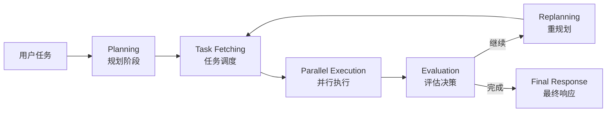

# LLM Compiler 架构提示词指南

## 📋 概述

本文档详细说明了 LLM Compiler 架构各个阶段的提示词设计，包括设计理念、使用场景和最佳实践。

**生成时间**: 2025-11-13  
**架构版本**: LLM Compiler v1.0  
**适用场景**: 安全渗透测试、自动化扫描、并行任务执行

---

## 🏗️ LLM Compiler 架构简介

LLM Compiler 是一个基于 DAG（有向无环图）的并行执行架构，其核心优势在于：

- ✅ **高并行度**: 自动识别可并行任务，最大化执行效率
- ✅ **智能调度**: 基于依赖关系动态调度任务执行
- ✅ **数据流优化**: 通过变量引用实现任务间高效数据传递
- ✅ **错误容忍**: 单个任务失败不影响独立任务执行
- ✅ **动态调整**: 支持运行时重规划和策略调整

### 执行流程



---

## 📝 各阶段提示词详解

### 1️⃣ Planning 阶段 - 规划器

**职责**: 将用户复杂任务拆解为可并行执行的 DAG 计划

**输入**:
- 用户原始任务描述
- 可用工具列表及其 Schema
- 执行上下文（可选）

**输出**: 完整的 DAG JSON 计划

**设计要点**:

#### 核心原则
1. **最大化并行度**: 识别所有可以并行执行的任务
2. **最小化依赖**: 只在必要时建立任务依赖关系
3. **优化数据流**: 使用变量引用避免数据重复传递

#### 安全测试优化
- **端口扫描**: 多目标可并行扫描
- **子域名枚举**: 分散到不同 DNS 服务器
- **漏洞扫描**: 依赖于端口开放确认
- **信息收集**: 优先级高于深度利用

#### 优先级分配策略

| 任务类型 | 优先级 | 说明 |
|---------|--------|------|
| 信息收集 | 1-2 | 最高优先级，为后续任务提供基础 |
| 端口/服务探测 | 2-3 | 高优先级，确定攻击面 |
| 漏洞扫描 | 4-5 | 中等优先级 |
| 深度分析 | 6-7 | 较低优先级 |
| 漏洞利用 | 8-9 | 低优先级，需谨慎执行 |
| 报告生成 | 10 | 最低优先级 |

#### 常见 DAG 模式

**模式1: 并行扫描**（无依赖）
```json
{
  "nodes": [
    {"task_id": "scan_1", "tool_name": "port_scan", "arguments": {"target": "192.168.1.1"}},
    {"task_id": "scan_2", "tool_name": "port_scan", "arguments": {"target": "192.168.1.2"}},
    {"task_id": "scan_3", "tool_name": "port_scan", "arguments": {"target": "192.168.1.3"}}
  ],
  "dependency_graph": {
    "scan_1": [],
    "scan_2": [],
    "scan_3": []
  },
  "parallelism_degree": 3
}
```

**模式2: 串行依赖**（先发现后利用）
```json
{
  "nodes": [
    {"task_id": "discover", "tool_name": "vuln_scan", "dependencies": []},
    {"task_id": "exploit", "tool_name": "exploit_tool", "arguments": {"vuln": "$discover"}, "dependencies": ["discover"]}
  ],
  "dependency_graph": {
    "discover": [],
    "exploit": ["discover"]
  }
}
```

**模式3: 扇出模式**（一对多）
```json
{
  "nodes": [
    {"task_id": "enum", "tool_name": "subdomain_enum", "dependencies": []},
    {"task_id": "check_1", "tool_name": "http_probe", "arguments": {"domain": "$enum.sub1"}, "dependencies": ["enum"]},
    {"task_id": "check_2", "tool_name": "http_probe", "arguments": {"domain": "$enum.sub2"}, "dependencies": ["enum"]},
    {"task_id": "check_3", "tool_name": "http_probe", "arguments": {"domain": "$enum.sub3"}, "dependencies": ["enum"]}
  ]
}
```

**模式4: 汇聚模式**（多对一）
```json
{
  "nodes": [
    {"task_id": "scan_a", "tool_name": "port_scan", "dependencies": []},
    {"task_id": "scan_b", "tool_name": "vuln_scan", "dependencies": []},
    {"task_id": "report", "tool_name": "generate_report", 
     "arguments": {"ports": "$scan_a", "vulns": "$scan_b"}, 
     "dependencies": ["scan_a", "scan_b"]}
  ]
}
```

#### 质量检查清单
- [ ] 所有 `task_id` 唯一
- [ ] `dependencies` 中的任务都存在
- [ ] 没有循环依赖
- [ ] 参数类型符合工具 Schema
- [ ] 变量引用都有映射
- [ ] 并行度合理（建议 2-5）
- [ ] JSON 格式完整可解析

---

### 2️⃣ Execution 阶段 - 执行器

**职责**: 并行执行任务并生成最终用户响应

**注意**: Executor 本身不需要 LLM，但在生成最终响应时会调用 LLM

**输入**:
- 所有任务执行结果
- 原始用户任务
- 执行统计信息

**输出**: 结构化的专业报告

**报告结构要求**:

#### 1. 执行摘要
- 总体执行情况
- 成功率统计
- 关键发现概览
- 时间性能数据

#### 2. 详细结果
```markdown
### 已完成任务 (3/5)

**任务: port_scan_target1**
- 状态: ✅ 成功
- 关键发现: 开放端口 22, 80, 443
- 详细输出:
  | 端口 | 服务 | 版本 |
  |-----|------|------|
  | 22  | SSH  | OpenSSH 7.4 |
  | 80  | HTTP | nginx 1.18 |
- 执行时间: 2345ms

**任务: vuln_scan_web**
- 状态: ❌ 失败
- 错误信息: Connection timeout
- 建议: 增加超时时间或检查网络连接
```

#### 3. 发现的问题
按严重性分类：
- 🔴 **严重/高危**: 可直接利用的漏洞
- 🟡 **中等**: 配置问题、潜在风险
- 🟢 **低危/信息**: 一般性发现
- ⚪ **无风险**: 正常状态确认

#### 4. 统计信息
```
- 总任务数: 5
- 成功任务: 3 (60%)
- 失败任务: 2 (40%)
- 总耗时: 8234ms
- 平均耗时: 1647ms/任务
- 并行度: 3
```

#### 5. 建议后续行动
1. 针对性的具体建议
2. 优先级排序
3. 可操作的步骤

---

### 3️⃣ Evaluation 阶段 - 评估器

**职责**: 评估执行结果，决定继续执行或完成任务

**输入**:
- 原始用户目标
- 当前轮次执行结果
- 历史执行摘要

**输出**: JSON 格式的决策结果

**决策标准**:

#### 应该 COMPLETE（完成）

| 条件 | 阈值 | 说明 |
|------|------|------|
| 目标完成度 | ≥ 80% | 主要目标已达成 |
| 成功率 | < 30% | 继续执行风险高 |
| 执行轮次 | ≥ max | 达到最大轮次 |
| 信息完整性 | 满足 | 获取了核心信息 |
| 继续价值 | 低 | 不太可能有新发现 |

#### 应该 CONTINUE（继续）

| 条件 | 阈值 | 说明 |
|------|------|------|
| 目标完成度 | < 60% | 关键信息有缺失 |
| 成功率 | > 50% | 执行状态良好 |
| 新发现 | 有 | 发现了新的攻击面 |
| 可重试任务 | 有 | 失败任务可优化重试 |

**评估维度**:

1. **目标完成度** (0.0-1.0)
   - 对照原始目标逐项检查
   - 考虑显性和隐性需求

2. **信息完整性** (0.0-1.0)
   - 关键字段是否齐全
   - 数据质量是否满足要求

3. **执行质量** (0.0-1.0)
   - 成功率 = 成功数 / 总数
   - 异常错误率

4. **继续价值** (0.0-1.0)
   - 预期新发现的可能性
   - 风险成本比

**输出格式示例**:

```json
{
  "decision": "COMPLETE",
  "completion_score": 0.85,
  "confidence": 0.9,
  "reasoning": "已成功扫描所有3个目标，发现开放端口信息完整。虽然有1个任务超时，但不影响整体目标达成。",
  "key_findings": [
    "目标1开放22,80,443端口，运行SSH和Web服务",
    "目标2仅开放80端口，疑似Web服务器",
    "目标3无响应，可能关闭或防火墙拦截"
  ],
  "missing_objectives": [],
  "suggested_actions": [
    "对发现的Web服务进行深度扫描",
    "对SSH服务进行版本识别和弱密码检测"
  ]
}
```

或

```json
{
  "decision": "CONTINUE",
  "completion_score": 0.35,
  "confidence": 0.8,
  "reasoning": "子域名枚举只发现2个子域，远低于预期。建议使用不同DNS服务器和更大字典重试。",
  "feedback": "当前枚举结果偏少，需要增加备用DNS查询和扩展字典",
  "suggested_tasks": [
    "使用公共DNS服务器(8.8.8.8, 1.1.1.1)重试枚举",
    "增加常见子域名字典",
    "尝试证书透明度日志查询"
  ],
  "risk_assessment": "低风险，继续枚举不会触发安全防护，建议继续"
}
```

---

### 4️⃣ Replanning 阶段 - 重规划器

**职责**: 根据执行反馈重新制定优化的执行计划

**输入**:
- 原始 DAG 计划
- 执行结果详情
- 评估器的反馈

**输出**: 新的完整 DAG 计划

**重规划策略**:

#### 策略矩阵

| 执行情况 | 成功率 | 完成度 | 采用策略 | 行动 |
|---------|--------|--------|---------|------|
| 大部分成功 | >70% | >60% | 增量补充 | 保留成功任务，添加补充任务 |
| 部分成功 | 40-70% | 30-60% | 调整优化 | 分析失败原因，调整参数重试 |
| 大部分失败 | <40% | <30% | 重新规划 | 改变整体策略和工具链 |

#### 场景分类

**场景1: 任务失败重试**
```
问题: 端口扫描超时
分析: 扫描范围过大，目标响应慢
解决: 
  - 减少端口范围（只扫描常用端口）
  - 增加超时时间
  - 分批次扫描
```

**场景2: 信息补充**
```
问题: 子域名枚举结果过少
分析: 字典不够全面，DNS服务器单一
解决:
  - 增加证书透明度查询
  - 使用多个公共DNS
  - 扩展子域名字典
```

**场景3: 深度探索**
```
问题: 发现开放端口需要进一步分析
分析: 端口扫描成功，但缺少服务详情
解决:
  - 添加服务版本识别任务
  - 添加漏洞扫描任务
  - 利用已有结果作为输入
```

**场景4: 策略调整**
```
问题: 暴力破解无效
分析: 目标有防护机制，当前方法不适用
解决:
  - 改用漏洞扫描方式
  - 尝试信息泄露检测
  - 社会工程学途径
```

**重规划模式示例**:

**模式1: 扇出扩展**
```json
{
  "plan_name": "子域名扫描扩展",
  "replanning_reason": "发现3个新子域名，需要逐个探测",
  "nodes": [
    {"task_id": "probe_sub1", "tool_name": "http_probe", 
     "arguments": {"domain": "$enum_result.subdomains[0]"}},
    {"task_id": "probe_sub2", "tool_name": "http_probe", 
     "arguments": {"domain": "$enum_result.subdomains[1]"}},
    {"task_id": "probe_sub3", "tool_name": "http_probe", 
     "arguments": {"domain": "$enum_result.subdomains[2]"}}
  ],
  "changes_from_original": {
    "added_tasks": ["probe_sub1", "probe_sub2", "probe_sub3"],
    "reason": "基于子域名枚举结果扩展探测任务"
  }
}
```

**模式2: 参数优化**
```json
{
  "plan_name": "优化端口扫描参数",
  "replanning_reason": "原任务超时，调整参数重试",
  "nodes": [
    {"task_id": "retry_scan", "tool_name": "port_scan",
     "arguments": {
       "target": "192.168.1.1",
       "ports": "22,80,443,3306,3389",  // 减少端口
       "timeout": 30000,  // 增加超时
       "rate": 100  // 降低扫描速率
     },
     "retry_count": 1}
  ],
  "changes_from_original": {
    "modified_tasks": ["original_scan"],
    "reason": "超时问题，调整参数：减少端口范围、增加超时、降低速率"
  }
}
```

**模式3: 工具替换**
```json
{
  "plan_name": "更换扫描工具",
  "replanning_reason": "原工具不支持目标类型，更换工具",
  "nodes": [
    {"task_id": "new_scan", "tool_name": "alternative_scanner",
     "arguments": {"target": "same_target"},
     "dependencies": []}
  ],
  "changes_from_original": {
    "removed_tasks": ["failed_scan"],
    "added_tasks": ["new_scan"],
    "reason": "原工具不兼容，替换为备用扫描器"
  }
}
```

**重规划检查清单**:
- [ ] 是否充分利用已完成任务的结果？
- [ ] 新任务是否针对性地解决了问题？
- [ ] 参数调整是否合理（避免重复失败）？
- [ ] 是否保留了有价值的执行结果？
- [ ] 任务数量是否合理（3-8个）？
- [ ] 依赖关系是否正确？
- [ ] 没有循环依赖？
- [ ] JSON 格式完整可解析？

---

## 🎯 最佳实践

### 1. 规划阶段最佳实践

#### DO ✅
- 优先识别可并行任务
- 合理设置任务优先级
- 明确标注依赖关系
- 使用描述性的 task_id
- 预估合理的执行时间

#### DON'T ❌
- 不要创建不必要的依赖
- 不要设置过大的并行度（建议≤5）
- 不要忽略工具参数验证
- 不要创建循环依赖
- 不要规划过多任务（建议≤10）

### 2. 评估阶段最佳实践

#### DO ✅
- 客观分析执行数据
- 考虑用户隐性需求
- 权衡继续执行的成本收益
- 给出明确的决策理由
- 提供可操作的建议

#### DON'T ❌
- 不要主观臆断目标完成度
- 不要忽略失败任务的原因
- 不要过度执行（目标已达成还继续）
- 不要低估继续执行的风险
- 不要给出模糊的决策

### 3. 重规划阶段最佳实践

#### DO ✅
- 保留并利用成功任务的结果
- 针对性地解决失败原因
- 增量式改进，不推倒重来
- 合理调整参数和策略
- 记录变更原因

#### DON'T ❌
- 不要重复执行成功的任务
- 不要盲目重试失败任务（不改参数）
- 不要忽略评估器的反馈
- 不要创建不必要的新任务
- 不要改变原始目标

---

## 📊 性能优化建议

### 1. 并行度优化
```
任务数量     推荐并行度
1-3个        1-2
4-6个        2-3
7-10个       3-4
10+个        4-5（不建议超过5）
```

### 2. 超时设置
```
任务类型           推荐超时
快速查询           5-10秒
端口扫描           15-30秒
漏洞扫描           30-60秒
深度分析           60-120秒
```

### 3. 重试策略
```
失败原因           重试建议
网络超时           增加超时，降低并发
参数错误           修正参数，不重试
工具不可用         更换工具
目标不可达         放弃或改变策略
```

---

## 🔧 使用说明

### 1. 导入提示词

```bash
# 进入项目目录
cd /Users/a1024/code/ai/sentinel-ai

# 导入到数据库
sqlite3 src-tauri/sentinel-ai.db < docs/llm_compiler_prompts.sql
```

### 2. 在界面中配置

1. 打开应用，进入 **设置 > 提示词管理**
2. 选择 **LLMCompiler** 架构
3. 查看并编辑各阶段提示词
4. 保存更改

### 3. 创建自定义版本

1. 复制默认提示词
2. 根据特定场景修改
3. 保存为新版本
4. 在提示词组中关联

### 4. 测试和验证

```bash
# 运行测试
cargo test llm_compiler --package sentinel-ai

# 查看日志
tail -f src-tauri/logs/sentinel-ai.log
```

---

## 📚 参考资料

- [LLM Compiler 论文](https://arxiv.org/abs/2312.04511)
- [DAG 任务调度原理](https://en.wikipedia.org/wiki/Directed_acyclic_graph)
- [Sentinel AI 架构文档](./ARCHITECTURE.md)

---

## 🤝 贡献

如果你有更好的提示词设计或使用经验，欢迎贡献：

1. Fork 项目
2. 创建特性分支
3. 提交改进的提示词
4. 发起 Pull Request

---

## 📝 更新日志

- **2025-11-13**: 初始版本，包含4个核心阶段的提示词
- 后续版本将根据使用反馈持续优化

---

**维护者**: Sentinel AI Team  
**最后更新**: 2025-11-13

