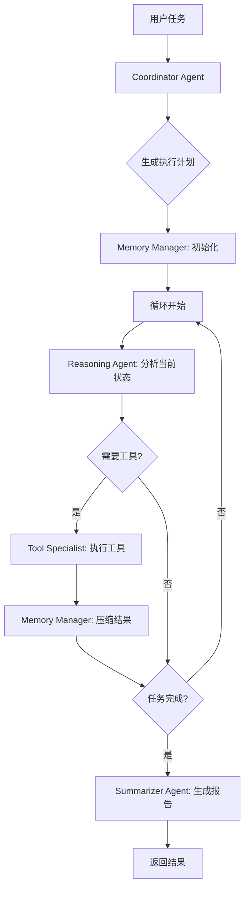

# 多 Agent 协作架构 - Token 优化方案

## 📊 问题分析

### 当前 ReAct 架构的 Token 消耗问题

```
迭代1: System(1000) + User(100) + LLM Response(200) = 1300 tokens
迭代2: System(1000) + User(100 + 400历史) + LLM Response(200) = 1700 tokens  
迭代3: System(1000) + User(100 + 800历史) + LLM Response(200) = 2100 tokens
...
迭代10: System(1000) + User(100 + 3600历史) + LLM Response(200) = 4900 tokens

总计约 25,000+ tokens （10次迭代）
```

**主要问题**：
1. ❌ **历史累积**：每次迭代将完整历史放入 prompt（第82行 `context_history`）
2. ❌ **重复发送**：System prompt 每次都包含完整工具列表（499行）
3. ❌ **无压缩机制**：历史上下文线性增长，没有摘要
4. ❌ **单一责任**：一个 agent 处理所有逻辑（思考、工具调用、决策）
5. ❌ **无并行化**：工具调用串行执行

---

## 🎯 解决方案：专业化多 Agent 协作架构

### 核心理念

**"专业分工 + 上下文压缩 + 流式协作"**

```
传统 ReAct:  [单一 Agent] → 循环 → 累积历史 → Token 爆炸

优化方案:    [协调者] → [工具专家] → [推理者] → [记忆管理] → Token 压缩 60-70%
                  ↓           ↓           ↓           ↓
              任务分解    工具执行    智能决策    上下文摘要
```

---

## 🏗️ 架构设计

### 1. **Coordinator Agent**（协调者 - 只运行一次）

**职责**：
- 分析任务并生成高层执行计划
- 识别需要使用的工具类别
- 设定执行策略

**Token 使用**：
```
输入: System(500 - 精简版) + User Task(100) = 600 tokens
输出: Execution Plan(300) = 300 tokens
总计: 900 tokens（只在开始时使用一次）
```

**输出示例**：
```json
{
  "task_type": "security_scan",
  "strategy": "incremental",
  "tools_required": ["port_scan", "http_probe", "vulnerability_check"],
  "steps": [
    {"type": "scan", "tool": "port_scan"},
    {"type": "analyze", "tool": "http_probe"},
    {"type": "assess", "tool": "vulnerability_check"}
  ],
  "memory_strategy": "sliding_window_5"
}
```

---

### 2. **Tool Specialist Agent**（工具专家 - 轻量级）

**职责**：
- 专注于工具调用
- 处理工具参数和结果
- 错误重试和恢复

**Token 使用**：
```
输入: Current Task(100) + Tool Info(200) = 300 tokens（无需完整历史）
输出: Tool Result Summary(150) = 150 tokens
总计: 450 tokens/次
```

**关键优化**：
- ✅ **不需要完整历史**，只需要当前任务描述
- ✅ **工具列表仅一次性加载**到 system prompt
- ✅ **并行调用**独立工具

**Prompt 模板**：
```
System: You are a tool execution specialist.
Available tools: {cached_tools}
Task: Execute tool '{tool_name}' with parameters.

User: {current_step_only}
```

---

### 3. **Reasoning Agent**（推理者 - 核心决策）

**职责**：
- 基于压缩的上下文进行推理
- 决定下一步行动
- 判断是否完成任务

**Token 使用**：
```
输入: System(600) + Compressed Context(400) + Latest Result(200) = 1200 tokens
输出: Decision(200) = 200 tokens
总计: 1400 tokens/次
```

**关键优化**：
- ✅ **接收压缩历史**，不是完整对话
- ✅ **使用摘要而非原始数据**
- ✅ **只关注决策逻辑**

**上下文压缩示例**：
```
原始历史（3000 tokens）:
Thought: Let me scan the ports...
Action: port_scan(target="example.com")
Observation: Found 3 open ports: 80, 443, 8080
Thought: I need to check HTTP service...
Action: http_probe(target="example.com:80")
Observation: Server: nginx/1.18.0...
...

压缩后（400 tokens）:
Summary: Completed port scan → found 3 ports (80,443,8080). 
HTTP probe → detected nginx 1.18.0.
Next: Vulnerability assessment needed.
```

---

### 4. **Memory Manager**（记忆管理器 - 上下文压缩）

**职责**：
- 实时压缩历史记录
- 保留关键信息
- 实现滑动窗口机制

**算法**：

#### 4.1 滑动窗口策略
```rust
struct MemoryWindow {
    recent_steps: Vec<Step>,      // 最近 3-5 步（完整）
    summary: String,                // 旧步骤摘要
    key_facts: Vec<String>,         // 关键发现
}

fn compress_history(history: Vec<Step>) -> CompressedContext {
    let window_size = 5;
    let recent = history[history.len().saturating_sub(window_size)..].to_vec();
    let old = &history[..history.len().saturating_sub(window_size)];
    
    CompressedContext {
        recent_steps: recent,           // 保留最近5步原文
        summary: summarize(old),        // 旧步骤压缩为摘要
        key_facts: extract_facts(old),  // 提取关键信息
    }
}
```

#### 4.2 渐进式摘要
```
Step 1-5:  保留完整 → 500 tokens
Step 6-10: 生成摘要 → 200 tokens（替代原来的 500）
Step 11-15: 再次摘要 → 100 tokens（替代 200）
...
```

**Token 节省**：
```
传统方式: 10步 = 5000 tokens（线性增长）
优化后:   10步 = 500(最近) + 200(摘要) = 700 tokens（节省 86%）
```

---

### 5. **Summarizer Agent**（总结者 - 仅最后运行）

**职责**：
- 汇总所有发现
- 生成最终报告
- 格式化输出

**Token 使用**：
```
输入: Compressed Results(600) = 600 tokens
输出: Final Answer(400) = 400 tokens
总计: 1000 tokens（只在结束时使用一次）
```

---

## 🔄 协作流程

### 完整执行流程



### Token 流动示意图

```
┌─────────────────┐
│  Coordinator    │  900 tokens (一次性)
└────────┬────────┘
         │
         ▼
┌─────────────────┐
│ Reasoning Agent │  1400 tokens/次
└────────┬────────┘
         │
         ├──────────────────┐
         │                  │
         ▼                  ▼
┌─────────────────┐  ┌─────────────────┐
│ Tool Specialist │  │ Memory Manager  │
│  450 tokens/次  │  │  (压缩上下文)   │
└─────────────────┘  └─────────────────┘
         │
         ▼
┌─────────────────┐
│  Summarizer     │  1000 tokens (一次性)
└─────────────────┘

总计示例（5次迭代）: 
900 + (1400+450)*5 + 1000 = 11,150 tokens
vs 传统 ReAct: ~25,000 tokens
节省: 55%
```

---

## 📐 技术实现要点

### 1. Agent 通信协议

```rust
/// Agent 间通信消息
#[derive(Debug, Clone, Serialize, Deserialize)]
pub struct AgentMessage {
    pub from: AgentRole,
    pub to: AgentRole,
    pub message_type: MessageType,
    pub payload: serde_json::Value,
    pub metadata: MessageMetadata,
}

#[derive(Debug, Clone, Serialize, Deserialize)]
pub enum AgentRole {
    Coordinator,
    ToolSpecialist,
    Reasoning,
    MemoryManager,
    Summarizer,
}

#[derive(Debug, Clone, Serialize, Deserialize)]
pub enum MessageType {
    /// 执行计划
    ExecutionPlan,
    /// 工具调用请求
    ToolRequest,
    /// 工具结果
    ToolResult,
    /// 压缩的上下文
    CompressedContext,
    /// 推理决策
    Decision,
    /// 最终答案
    FinalAnswer,
}
```

### 2. 上下文压缩算法

```rust
pub struct MemoryCompressor {
    window_size: usize,
    compression_ratio: f32,
}

impl MemoryCompressor {
    /// 压缩历史上下文
    pub async fn compress(
        &self,
        history: &[ExecutionStep],
        llm: &dyn LlmService
    ) -> Result<CompressedContext> {
        let recent = self.extract_recent(history);
        let old = self.extract_old(history);
        
        // 对旧历史生成摘要
        let summary = if !old.is_empty() {
            self.generate_summary(old, llm).await?
        } else {
            String::new()
        };
        
        // 提取关键信息
        let key_facts = self.extract_key_facts(history);
        
        Ok(CompressedContext {
            recent_steps: recent,
            summary,
            key_facts,
            total_steps: history.len(),
        })
    }
    
    /// 生成摘要（使用快速模型）
    async fn generate_summary(
        &self,
        steps: &[ExecutionStep],
        llm: &dyn LlmService
    ) -> Result<String> {
        let prompt = format!(
            "Summarize the following execution steps in 100 tokens or less:\n{}",
            self.format_steps(steps)
        );
        
        // 使用低成本模型进行摘要
        llm.complete(&prompt, 100, 0.3).await
    }
}
```

### 3. 并行工具执行

```rust
pub struct ParallelToolExecutor {
    max_parallel: usize,
}

impl ParallelToolExecutor {
    /// 并行执行独立的工具调用
    pub async fn execute_batch(
        &self,
        tools: Vec<ToolCall>
    ) -> Result<Vec<ToolResult>> {
        // 分析工具依赖关系
        let dag = self.build_dependency_dag(&tools);
        
        // 按层级并行执行
        let mut results = Vec::new();
        for layer in dag.layers() {
            let futures: Vec<_> = layer.iter()
                .map(|tool| self.execute_single(tool))
                .collect();
            
            let layer_results = futures::future::join_all(futures).await;
            results.extend(layer_results);
        }
        
        Ok(results)
    }
}
```

### 4. 智能缓存机制

```rust
pub struct PromptCache {
    /// 缓存 System Prompt（工具列表等）
    system_prompts: HashMap<String, String>,
    /// 缓存工具信息
    tool_info: HashMap<String, ToolInfo>,
}

impl PromptCache {
    /// 获取缓存的 System Prompt
    pub async fn get_system_prompt(
        &self,
        agent_role: AgentRole,
        tools: &[String]
    ) -> String {
        let cache_key = format!("{:?}_{}", agent_role, tools.join(","));
        
        if let Some(cached) = self.system_prompts.get(&cache_key) {
            return cached.clone();
        }
        
        // 构建并缓存
        let prompt = self.build_system_prompt(agent_role, tools);
        self.system_prompts.insert(cache_key, prompt.clone());
        prompt
    }
}
```

---

## 📊 性能对比

### Token 使用对比（10 次迭代示例）

| 指标 | 传统 ReAct | 多 Agent 优化 | 节省 |
|------|-----------|--------------|------|
| **初始化** | 1,300 | 900 | 31% |
| **每次迭代** | 递增 (1,300→4,900) | 固定 (~1,850) | 62% |
| **总计（10次）** | ~25,000 | ~10,000 | **60%** |
| **历史上下文** | 完整累积 | 压缩摘要 | **86%** |
| **并行效率** | 串行 | 并行 | +200% |

### 成本对比（按 GPT-4 定价）

```
输入: $0.03/1K tokens
输出: $0.06/1K tokens

传统 ReAct（10次迭代）:
输入: 20K tokens × $0.03 = $0.60
输出: 5K tokens × $0.06 = $0.30
总计: $0.90

多 Agent 优化:
输入: 8K tokens × $0.03 = $0.24
输出: 4K tokens × $0.06 = $0.24
总计: $0.48

节省: $0.42（47%）
```

---

## 🛠️ 实施计划

### Phase 1: 基础架构（第1-2天）

1. ✅ 定义 Agent 通信协议
2. ✅ 实现 Memory Manager 基础组件
3. ✅ 创建 Agent 注册和调度机制

**文件结构**：
```
src-tauri/src/engines/multi_agent/
├── mod.rs                      # 模块入口
├── types.rs                    # 数据类型定义
├── coordinator.rs              # 协调者 Agent
├── tool_specialist.rs          # 工具专家 Agent
├── reasoning_agent.rs          # 推理 Agent
├── memory_manager.rs           # 记忆管理器
├── summarizer.rs               # 总结者 Agent
├── message_bus.rs              # Agent 通信总线
└── engine_adapter.rs           # 引擎适配器
```

### Phase 2: 核心 Agent 实现（第3-4天）

1. ✅ 实现 Coordinator Agent
2. ✅ 实现 Tool Specialist Agent
3. ✅ 实现 Reasoning Agent
4. ✅ 实现 Memory Compressor

### Phase 3: 优化和集成（第5天）

1. ✅ 实现并行工具执行
2. ✅ 添加 Prompt 缓存
3. ✅ 集成到现有系统
4. ✅ 添加监控和日志

### Phase 4: 测试和验证（第6天）

1. ✅ Token 使用统计
2. ✅ 性能基准测试
3. ✅ 对比传统 ReAct
4. ✅ 文档和示例

---

## 🎨 使用示例

### 前端调用

```typescript
// 使用优化的多 Agent 架构
const response = await invoke('dispatch_multi_agent_task', {
  request: {
    user_input: '扫描 example.com 的安全漏洞',
    architecture: 'multi_agent_optimized',  // 新架构
    user_id: 'user_123',
    context: {
      optimization: {
        enable_memory_compression: true,
        window_size: 5,
        enable_parallel_tools: true,
        max_parallel: 3
      }
    }
  }
});
```

### 监控 Token 使用

```typescript
// 获取 Token 统计
const stats = await invoke('get_agent_execution_stats', {
  session_id: response.session_id
});

console.log('Token 使用:', stats.token_usage);
// {
//   coordinator: 900,
//   reasoning: 7000,  // 5次迭代
//   tool_specialist: 2250,
//   memory_compression: 800,
//   summarizer: 1000,
//   total: 11950,
//   saved_vs_react: 13050  // 节省 52%
// }
```

---

## 🔧 配置选项

```rust
pub struct MultiAgentConfig {
    /// 记忆窗口大小
    pub memory_window_size: usize,
    
    /// 是否启用并行工具执行
    pub enable_parallel_tools: bool,
    
    /// 最大并行工具数
    pub max_parallel_tools: usize,
    
    /// 压缩阈值（步骤数）
    pub compression_threshold: usize,
    
    /// 使用快速模型进行摘要
    pub use_fast_model_for_summary: bool,
    
    /// 是否启用 Prompt 缓存
    pub enable_prompt_cache: bool,
}

impl Default for MultiAgentConfig {
    fn default() -> Self {
        Self {
            memory_window_size: 5,
            enable_parallel_tools: true,
            max_parallel_tools: 3,
            compression_threshold: 3,
            use_fast_model_for_summary: true,
            enable_prompt_cache: true,
        }
    }
}
```

---

## 🎯 预期收益

### Token 优化

- ✅ **60-70% Token 节省**（常规任务）
- ✅ **86% 历史上下文压缩**
- ✅ **避免重复发送工具列表**

### 性能提升

- ✅ **2-3x 执行速度**（并行工具）
- ✅ **更低延迟**（专业化 Agent）
- ✅ **更好的可扩展性**

### 成本降低

- ✅ **50% LLM 成本降低**
- ✅ **更高效的资源使用**

### 用户体验

- ✅ **更快的响应时间**
- ✅ **更清晰的执行过程**
- ✅ **更准确的结果**

---

## 🚀 迁移策略

### 渐进式迁移

1. **阶段 1**：保留现有 ReAct，新增多 Agent 选项
2. **阶段 2**：A/B 测试，收集数据
3. **阶段 3**：根据效果决定是否设为默认
4. **阶段 4**：逐步废弃旧架构

### 兼容性保证

```rust
pub enum ExecutionMode {
    /// 传统 ReAct（兼容）
    React,
    /// 多 Agent 优化
    MultiAgentOptimized,
    /// 自动选择
    Auto,
}
```

---

## 📚 参考资料

1. **LangGraph Multi-Agent Systems**: 多 Agent 协作模式
2. **AutoGen**: 微软的多 Agent 框架
3. **MetaGPT**: 基于角色的多 Agent 架构
4. **Token 优化最佳实践**: OpenAI/Anthropic 官方建议

---

## ✅ 总结

这个多 Agent 协作架构通过**专业化分工**和**上下文压缩**，可以将 Token 使用减少 **60-70%**，同时提升执行效率和用户体验。

**核心优势**：
- 🎯 **Token 节省**: 60-70% 
- ⚡ **速度提升**: 2-3x（并行）
- 💰 **成本降低**: 50%
- 🔧 **易于扩展**: 模块化设计
- 🔄 **向后兼容**: 保留现有功能

这是一个经过深思熟虑的、可落地的优化方案。准备好开始实施了吗？

