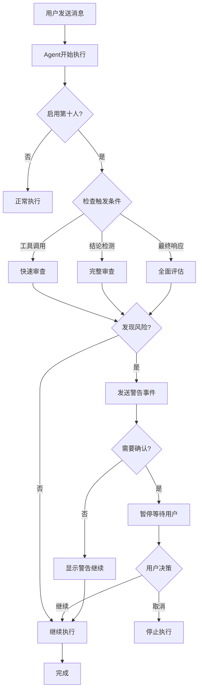

# 第十人原则融入会话过程 - 实施总结

## 📋 实施概述

已成功将第十人原则从"会话结束后审查"改造为"实时会话参与者"，在关键节点主动介入质疑。

## ✅ 完成的功能

### Phase 1: 架构增强

#### 1.1 增强 TenthMan 结构 (`src-tauri/src/agents/tenth_man.rs`)

- ✅ 添加 `InterventionMode` 枚举
  - `FinalOnly`: 仅最终审查（原有模式）
  - `Proactive`: 主动介入（新增）
  - `Realtime`: 实时监控（预留）

- ✅ 添加 `InterventionContext` 结构
  - 包含执行ID、任务、工具调用计数、当前内容、触发原因

- ✅ 添加 `TriggerReason` 枚举
  - `ToolCallThreshold`: 工具调用阈值
  - `DangerousKeyword`: 危险关键词
  - `ConclusionDetected`: 结论检测
  - `FinalResponse`: 最终响应
  - `Manual`: 手动触发

- ✅ 实现 `should_trigger()` 方法
  - 根据干预模式和上下文决定是否触发审查

- ✅ 实现 `quick_review()` 方法
  - 轻量级快速审查，用于实时监控

- ✅ 实现 `contains_conclusion_markers()` 方法
  - 检测结论性语句标记（中英文）

#### 1.2 修改 AgentExecuteParams (`src-tauri/src/agents/executor.rs`)

- ✅ 添加 `tenth_man_config: Option<TenthManConfig>` 字段
- ✅ 导入相关类型 (`TenthManConfig`, `InterventionContext`, `TriggerReason`)

### Phase 2: 执行流程改造

#### 2.1 工具调用前触发审查 (`src-tauri/src/agents/executor.rs`)

- ✅ 在 `StreamContent::ToolCallStart` 处添加干预点
- ✅ 检查是否应该触发审查
- ✅ 异步执行 `quick_review()`
- ✅ 发送 `agent:tenth_man_warning` 事件到前端

#### 2.2 文本流中检测结论并审查 (`src-tauri/src/agents/executor.rs`)

- ✅ 在 `StreamContent::Text` 处添加干预点
- ✅ 累积文本内容并检测结论性标记
- ✅ 触发完整的 `review()` 审查
- ✅ 发送 `agent:tenth_man_intervention` 事件到前端

### Phase 3: 前端集成

#### 3.1 事件监听 (`src/composables/useAgentEvents.ts`)

- ✅ 监听 `agent:tenth_man_warning` 事件
  - 工具调用前的警告
  - 支持 `requires_confirmation` 标志

- ✅ 监听 `agent:tenth_man_intervention` 事件
  - 结论检测时的干预
  - 添加为系统消息

- ✅ 监听 `agent:tenth_man_critique` 事件
  - 最终审查（兼容旧格式）

#### 3.2 UI 展示 (`src/components/Agent/MessageBlock.vue`)

- ✅ 更新 `isTenthManCritique` 计算属性
  - 支持所有第十人消息类型
  - `tenth_man_critique`
  - `tenth_man_intervention`
  - `tenth_man_warning`

- ✅ 已有的第十人UI组件
  - 红色警告面板
  - 特殊图标和样式
  - Markdown 渲染

### Phase 4: 配置持久化

#### 4.1 命令接口 (`src-tauri/src/commands/ai.rs`)

- ✅ 在 `AgentExecuteConfig` 中添加 `tenth_man_config` 字段
- ✅ 传递配置到 `AgentExecuteParams`

#### 4.2 设置组件 (`src/components/Settings/TenthManSettings.vue`)

- ✅ 启用/禁用开关
- ✅ 干预模式选择（FinalOnly / Proactive）
- ✅ 工具调用间隔配置
- ✅ 危险关键词配置
- ✅ 需要确认选项
- ✅ 配置持久化到数据库

#### 4.3 国际化

- ✅ 中文翻译 (`src/i18n/locales/settings/zh.ts`)
- ✅ 英文翻译 (`src/i18n/locales/settings/en.ts`)

## 🎯 关键特性

### 1. 实时干预

第十人不再是"事后诸葛亮"，而是在执行过程中主动介入：

```
User: 请帮我删除所有日志文件
  ↓
Agent: 准备调用 shell 工具执行 rm -rf /logs/*
  ↓
🔍 Tenth Man: ⚠️ 警告！检测到危险操作 rm -rf
  ↓
[用户可以选择继续或取消]
```

### 2. 多层次审查

- **工具调用前**: 快速检查（轻量级）
- **结论检测时**: 完整审查（深度分析）
- **最终响应时**: 全面评估（保留原有功能）

### 3. 灵活配置

```rust
TenthManConfig {
    mode: Proactive {
        tool_call_interval: Some(3),  // 每3个工具调用审查一次
        dangerous_keywords: vec![
            "rm -rf".to_string(),
            "DROP TABLE".to_string(),
            "DELETE FROM".to_string(),
        ],
    },
    require_user_confirmation: true,  // 危险操作需确认
}
```

## 📊 工作流程



## 🔧 使用方法

### 后端配置

```rust
let executor_params = AgentExecuteParams {
    // ... 其他参数 ...
    enable_tenth_man_rule: true,
    tenth_man_config: Some(TenthManConfig {
        mode: InterventionMode::Proactive {
            tool_call_interval: Some(3),
            dangerous_keywords: vec![
                "rm -rf".to_string(),
                "DROP TABLE".to_string(),
            ],
        },
        auto_inject_to_context: false,
        require_user_confirmation: true,
    }),
};
```

### 前端配置

在设置界面中：
1. 启用"第十人原则"
2. 选择干预模式：
   - 仅最终审查
   - 主动介入
3. 配置工具调用间隔（如果选择主动介入）
4. 添加危险关键词
5. 选择是否需要用户确认

### 数据库配置

```sql
INSERT INTO sentinel_config (category, key, value) VALUES
('agent', 'tenth_man_enabled', 'true'),
('agent', 'tenth_man_mode', 'proactive'),
('agent', 'tenth_man_tool_interval', '3'),
('agent', 'tenth_man_dangerous_keywords', '["rm -rf", "DROP TABLE", "DELETE FROM"]'),
('agent', 'tenth_man_require_confirmation', 'true');
```

## 📝 事件格式

### agent:tenth_man_warning

```typescript
{
  execution_id: string,
  trigger: "before_tool_call",
  tool_name: string,
  critique: string,
  requires_confirmation: boolean
}
```

### agent:tenth_man_intervention

```typescript
{
  execution_id: string,
  trigger: "conclusion_detected",
  critique: string,
  timestamp: number
}
```

### agent:tenth_man_critique

```typescript
{
  execution_id: string,
  critique: string,
  message_id: string
}
```

## 🎨 UI 展示

第十人消息以特殊样式显示：
- 🔴 红色边框和背景
- 🕵️ 特殊图标
- ⚠️ 警告标识
- 📝 Markdown 格式化内容

## 🚀 下一步优化建议

### P1 - 高优先级
1. 实现用户确认对话框（目前仅显示警告）
2. 添加第十人审查历史记录
3. 支持用户反馈（审查是否有用）

### P2 - 中优先级
4. 实现 Realtime 模式（每条消息都审查）
5. 添加审查质量评分
6. 支持自定义审查规则

### P3 - 低优先级
7. 审查结果可视化统计
8. 导出审查报告
9. 多语言 Prompt 优化

## 📚 相关文件

### 后端
- `src-tauri/src/agents/tenth_man.rs` - 核心逻辑
- `src-tauri/src/agents/executor.rs` - 执行流程集成
- `src-tauri/src/commands/ai.rs` - 命令接口

### 前端
- `src/composables/useAgentEvents.ts` - 事件监听
- `src/components/Agent/MessageBlock.vue` - UI 展示
- `src/components/Settings/TenthManSettings.vue` - 配置界面
- `src/i18n/locales/settings/zh.ts` - 中文翻译
- `src/i18n/locales/settings/en.ts` - 英文翻译

## ✅ 测试检查清单

- [ ] 启用第十人原则后，工具调用前显示警告
- [ ] 检测到结论性语句时触发干预
- [ ] 最终响应时显示完整审查
- [ ] 配置可以正确保存和加载
- [ ] 中英文界面翻译正确
- [ ] 不同干预模式切换正常
- [ ] 危险关键词检测生效

## 🎉 总结

第十人原则已成功从"事后审查"升级为"实时参与者"，能够在关键决策点主动介入，提供对抗性思维，帮助用户避免潜在风险。

核心改进：
- ✅ 实时监控和干预
- ✅ 多层次审查机制
- ✅ 灵活的配置选项
- ✅ 完整的前后端集成
- ✅ 友好的UI展示

---

**实施日期**: 2026-01-12  
**版本**: v1.0.0  
**状态**: ✅ 已完成
