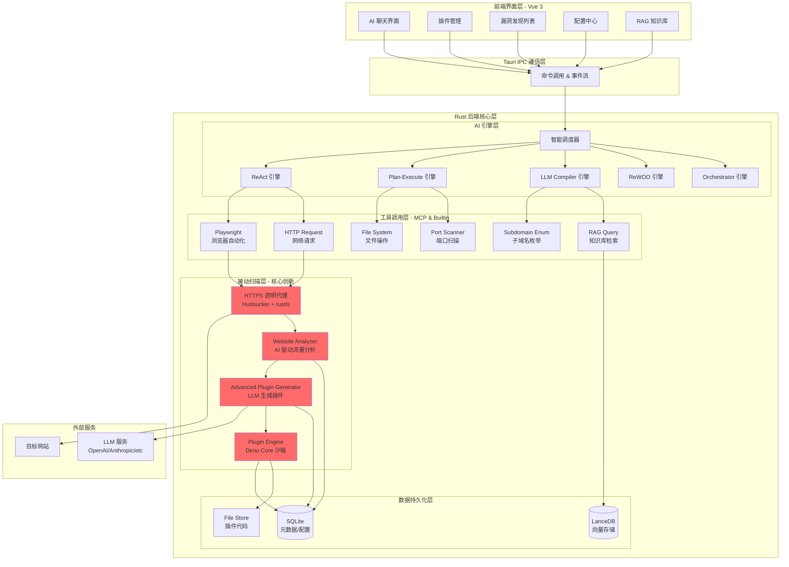
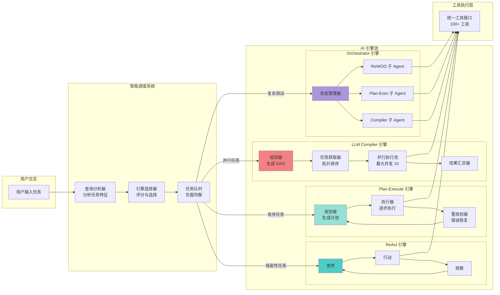
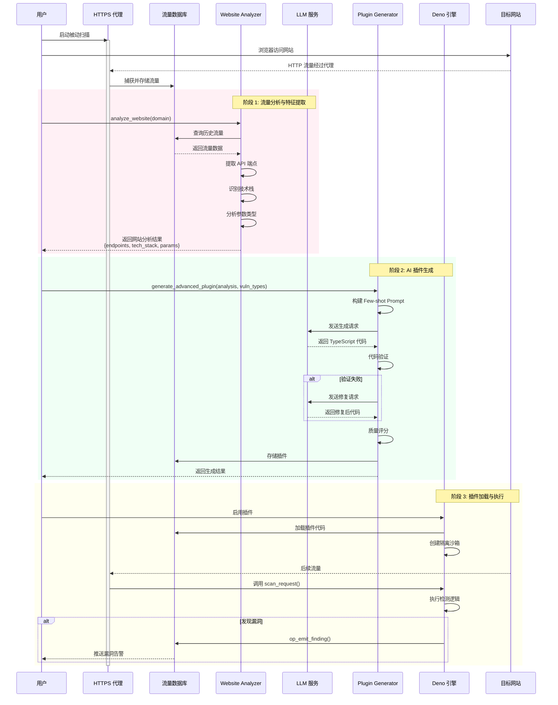
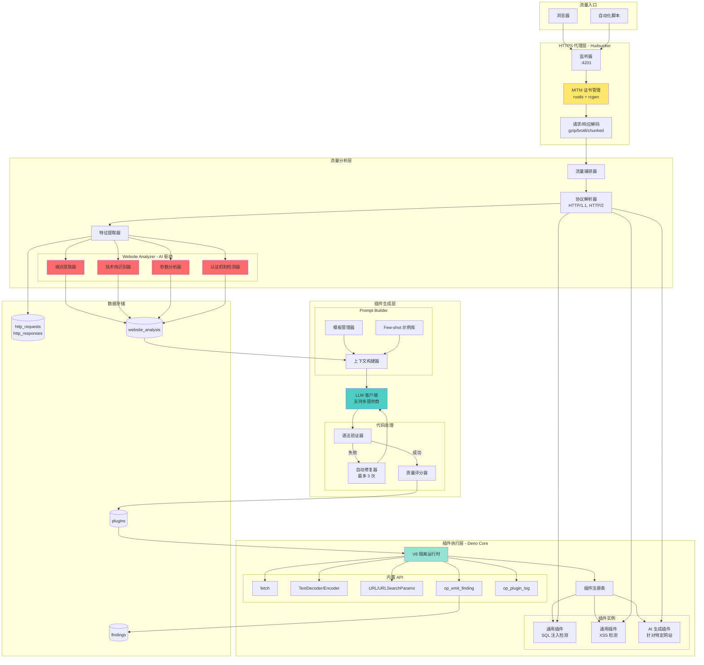
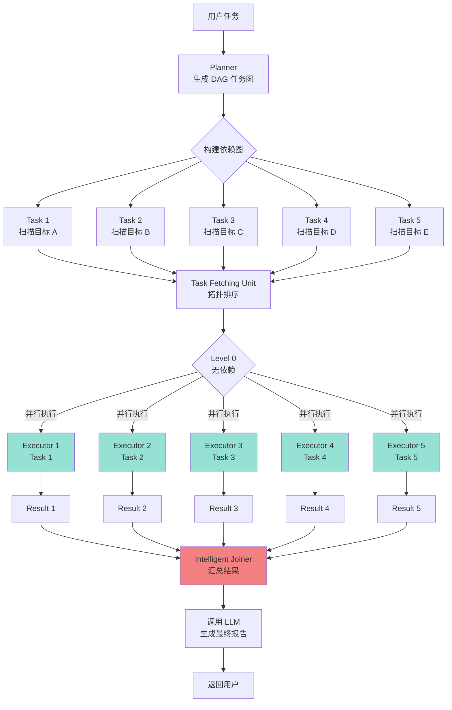
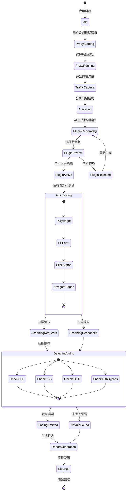
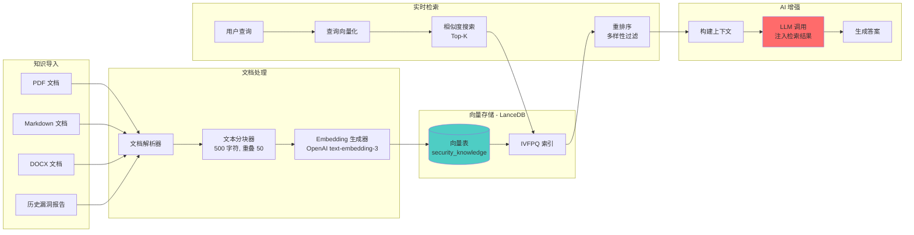
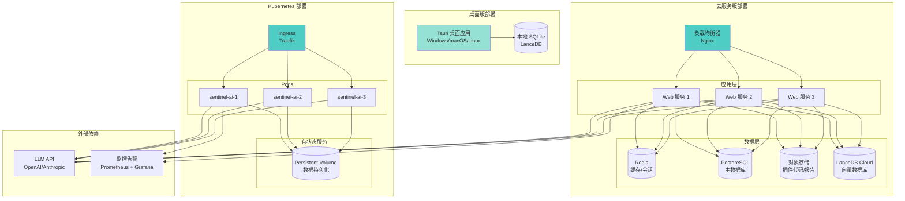
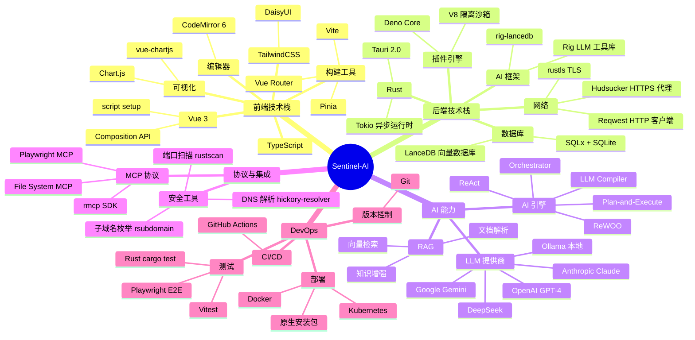

# Sentinel-AI 系统架构图

本文档包含 Sentinel-AI 项目的各个层次的架构图，使用 Mermaid 格式绘制。

## 1. 总体系统架构



## 2. AI 引擎协同架构



## 3. "Vibe Hacking" 核心流程



## 4. 被动扫描详细架构



## 5. 数据库 E-R 图

```mermaid
erDiagram
    AI_PROVIDERS ||--o{ AI_SESSIONS : uses
    AI_PROVIDERS {
        string id PK
        string provider
        string name
        string api_key
        string base_url
        boolean is_active
    }
    
    AI_SESSIONS ||--o{ AGENT_MESSAGES : contains
    AI_SESSIONS {
        string id PK
        string title
        string provider_id FK
        string model
        datetime created_at
    }
    
    AGENT_MESSAGES {
        string id PK
        string session_id FK
        string role
        text content
        text tool_calls
        datetime timestamp
    }
    
    PLUGINS ||--o{ FINDINGS : detects
    PLUGINS {
        string id PK
        string name
        string version
        string category
        text code
        string status
        float quality_score
        datetime created_at
    }
    
    HTTP_REQUESTS ||--|| HTTP_RESPONSES : paired
    HTTP_REQUESTS ||--o{ FINDINGS : triggers
    HTTP_REQUESTS {
        string id PK
        string url
        string method
        text headers
        blob body
        datetime timestamp
    }
    
    HTTP_RESPONSES {
        string request_id PK_FK
        int status
        text headers
        blob body
        datetime timestamp
    }
    
    FINDINGS {
        string id PK
        string request_id FK
        string plugin_id FK
        string vuln_type
        string severity
        string confidence
        text evidence
        text description
        datetime detected_at
    }
    
    WEBSITE_ANALYSIS {
        string id PK
        string domain
        json endpoints
        json tech_stack
        json parameters
        json auth_mechanisms
        datetime analyzed_at
    }
    
    PROMPTS {
        string id PK
        string name
        string template_type
        text content
        int priority
        boolean is_active
        boolean is_default
    }
    
    RAG_DOCUMENTS {
        string id PK
        string file_path
        string file_type
        text content
        vector embedding
        json metadata
        datetime imported_at
    }
    
    TEST_SESSIONS ||--o{ TEST_STEPS : contains
    TEST_SESSIONS ||--o{ FINDINGS : discovers
    TEST_SESSIONS {
        string id PK
        string task_kind
        string primary_target
        string current_stage
        json auth_context
        datetime started_at
    }
    
    TEST_STEPS {
        string id PK
        string session_id FK
        string step_type
        string sub_agent
        string status
        text output
        datetime started_at
    }
```

## 6. LLM Compiler 并行执行流程



## 7. 完整安全测试工作流



## 8. RAG 知识增强系统



## 9. 部署架构



## 10. 技术栈全景图



---

## 使用说明

这些架构图可以直接在支持 Mermaid 的 Markdown 编辑器中查看，如：
- GitHub
- GitLab
- VS Code（需安装 Mermaid 插件）
- Typora
- Obsidian

也可以使用在线工具预览：
- https://mermaid.live/
- https://mermaid.ink/

## 架构图说明

1. **总体系统架构**：展示了从前端到后端的完整层次结构
2. **AI 引擎协同架构**：展示了 5 种 AI 引擎的工作方式和智能调度机制
3. **"Vibe Hacking" 核心流程**：时序图展示了从流量捕获到插件生成的完整过程
4. **被动扫描详细架构**：核心创新模块的详细实现
5. **数据库 E-R 图**：展示了所有数据表及其关系
6. **LLM Compiler 并行执行流程**：展示了并行任务调度的实现
7. **完整安全测试工作流**：状态图展示了测试的完整生命周期
8. **RAG 知识增强系统**：展示了知识库的构建和检索流程
9. **部署架构**：展示了桌面版、云服务版和 K8s 部署方案
10. **技术栈全景图**：思维导图展示了所有使用的技术

---

**文档版本**：v1.0  
**创建日期**：2025-11-19  
**维护者**：Sentinel-AI 团队

